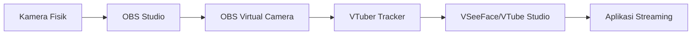

# Panduan Integrasi dengan OBS Studio

## Deskripsi
Panduan ini menjelaskan cara menggunakan VTuber Tracker dengan OBS Virtual Camera untuk workflow streaming yang lebih kompleks.

## Workflow OBS + VTuber Tracker

### 1. **Setup Dasar**


### 2. **Langkah-langkah Setup**

#### A. Di OBS Studio:
1. **Tambahkan Source Kamera**
   - Klik `+` di panel Sources
   - Pilih `Video Capture Device`
   - Pilih kamera fisik Anda
   - Atur resolusi: 640x480 (untuk kompatibilitas terbaik)

2. **Aktifkan Virtual Camera**
   - Klik `Tools` > `Virtual Camera`
   - Klik `Start Virtual Camera`
   - Tunggu sampai muncul status "Virtual Camera Active"

3. **(Opsional) Tambahkan Efek**
   - Chroma key untuk background removal
   - Transformasi untuk posisi kamera
   - Filter noise reduction

#### B. Di VTuber Tracker:
1. **Deteksi Virtual Camera**
   ```bash
   python camera_util.py detect
   ```

2. **Gunakan Virtual Camera sebagai Input**
   ```python
   config = VTuberConfig(
       camera_index=1,  # Biasanya OBS Virtual Camera di indeks 1
       enable_vmc_output=True
   )
   ```

### 3. **Keuntungan Setup Ini**

✅ **Layer Efek**: Tambahkan efek di OBS sebelum pelacakan wajah  
✅ **Flexibility**: Bisa menggabungkan dengan scene lain di OBS  
✅ **Background Control**: Gunakan chroma key di OBS  
✅ **Audio Sync**: Audio dan video tetap sinkron  

### 4. **Troubleshooting Umum**

#### Masalah: Tidak ada kamera OBS terdeteksi
**Solusi**: 
- Pastikan OBS Virtual Camera benar-benar aktif
- Restart OBS setelah kamera fisik terhubung
- Cek di Device Manager (Windows) atau `ls /dev/video*` (Linux)

#### Masalah: Delay tinggi
**Solusi**:
- Gunakan resolusi lebih rendah (640x480)
- Kurangi efek yang berat di OBS
- Gunakan setting FPS yang sesuai (30 FPS)

#### Masalah: Tidak ada output ke VSeeFace
**Solusi**:
- Pastikan VSeeFace dijalankan sebelum VTuber Tracker
- Cek konfigurasi port dan host
- Pastikan tidak ada firewall yang memblokir

### 5. **Performance Tips**

- **CPU**: Gunakan preset performance tinggi di OBS
- **Resolusi**: Gunakan 640x480 untuk pelacakan, upscale di OBS untuk output
- **FPS**: Gunakan 30 FPS untuk keseimbangan kualitas dan performansi
- **Filter**: Gunakan minimal filter di OBS untuk mengurangi delay

### 6. **Contoh Konfigurasi OBS**

#### Video Settings:
- Base Resolution: 1280x720
- Output Resolution: 1280x720  
- FPS: 30

#### Virtual Camera Settings:
- Format: YUV422 (interlaced) atau RGB
- Jangan gunakan "Start this virtual camera on startup"

#### Scene Setup:
```
- Video Capture Device (Kamera Fisik)
  - Resolution: 640x480
  - Crop/Position sesuai kebutuhan
```

### 7. **Contoh Penggunaan Kode**

Lihat file `obs_integration_example.py` untuk contoh lengkapnya.

### 8. **Alternatif Lain**

Jika setup OBS terlalu kompleks, alternatif:
- Gunakan kamera fisik langsung ke VTuber Tracker (lebih simple)
- Gunakan plugin OBS yang langsung mengirim ke VMC (seperti OBS-VTube-Studio)

## Kesimpulan

Setup OBS + VTuber Tracker memberikan fleksibilitas tinggi untuk streamer yang ingin menggunakan efek tambahan atau menggabungkan dengan scene OBS lainnya. Walaupun lebih kompleks, setup ini memberikan kontrol maksimum atas output akhir.